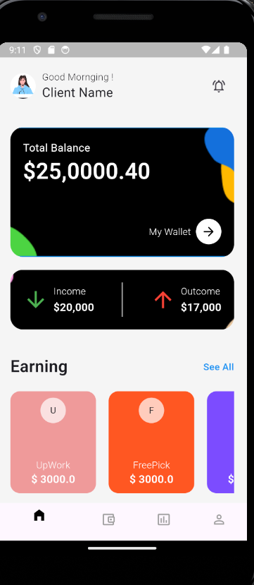
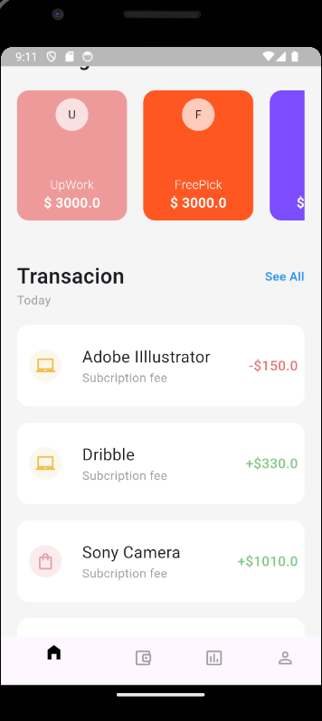
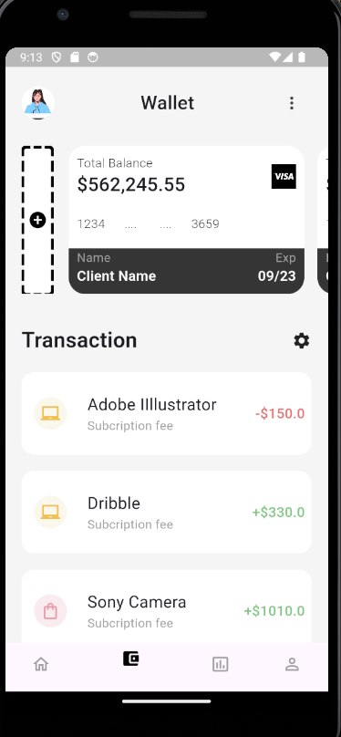
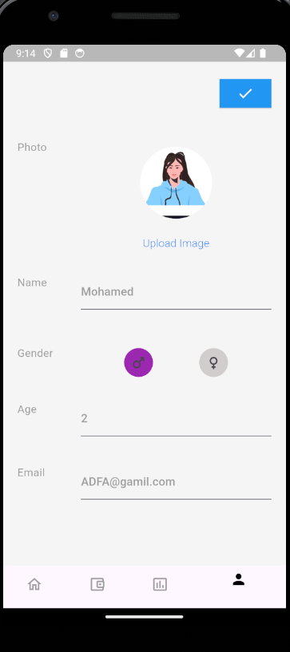

# Mobile App Prototype

## Objective

The objective of this task is to create a new mobile app prototype for a fintech company using Flutter. The app should provide an intuitive and seamless user experience, focusing on core functionalities such as the home page, wallet page, and user profile page.

## Features

- **Home Page**: Displays the main dashboard with key information and navigation options.
- **Wallet Page**: Shows wallet details, transactions, and other related functionalities.
- **User Profile Page**: Allows users to view and edit their profile information.

## Architecture

The project follows the Clean Architecture pattern, utilizing the MVVM (Model-View-ViewModel) pattern for state management and separation of concerns.

### Layers

1. **Data Layer**: Holds the models and handles data operations.
2. **Domain Layer**: Contains Entities and usecases.
3. **Presentation Layer**: Contains the state management and UI screens.

### State Management

The app uses the Cubit package for state management, ensuring a reactive and maintainable codebase.

### Service Locator

The `GetIt` package is used for dependency injection, making it easy to manage and inject dependencies throughout the app.

### Screenshots

#### Home Page

#### Wallet Page

#### User Profile Page

## Demo Video

Watch the demo video

